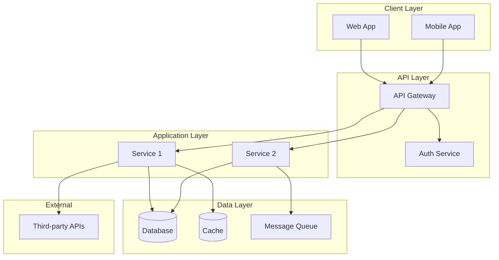
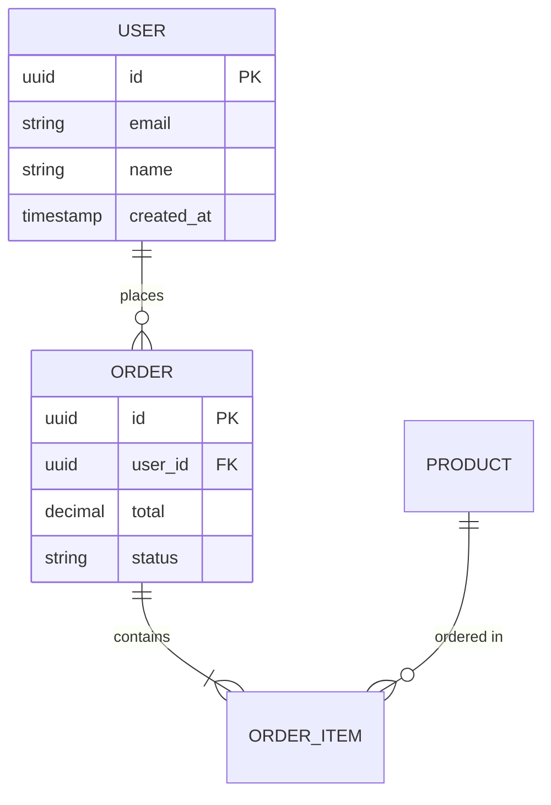
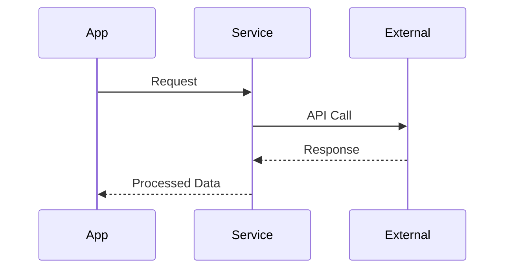
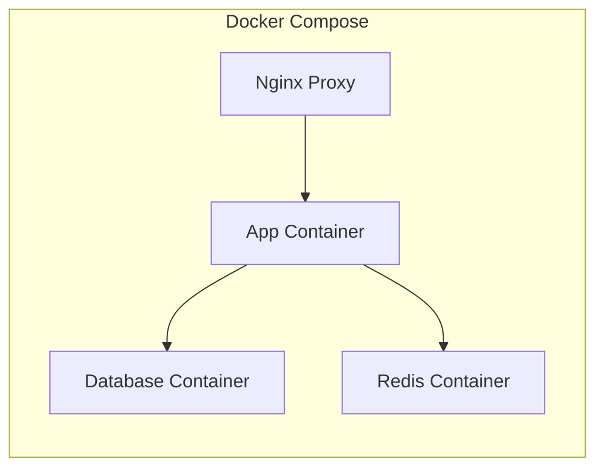
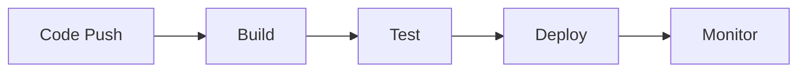
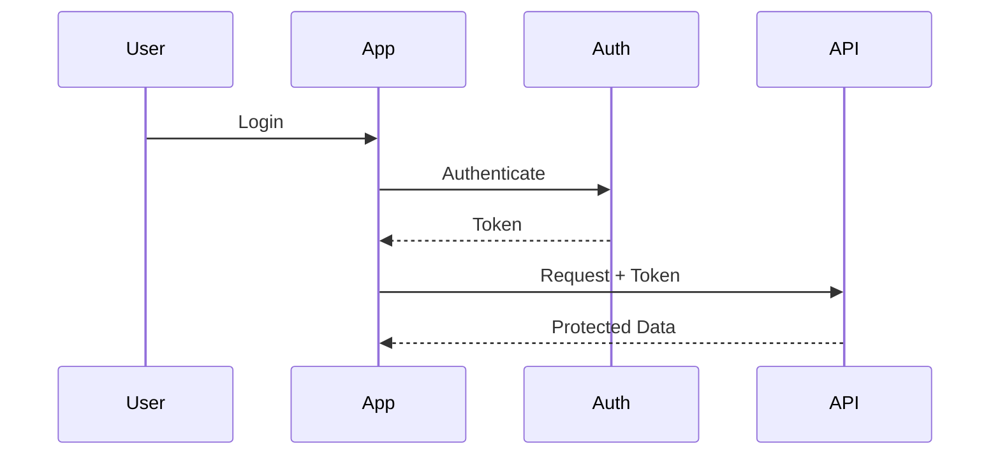

# System Architecture

## Overview

[High-level description of the overall system architecture — what it is and how parts work together.]

## Architecture Diagram



## Architecture Principles

1. **[Principle 1]**: [Description and why it matters]
2. **[Principle 2]**: [Description]
3. **[Principle 3]**: [Description]

---

## Frontend Architecture

<!-- Remove this section if no frontend -->

### Overview

[Description of frontend architecture approach]

### Technology Stack

| Layer | Technology | Purpose |
|-------|------------|---------|
| Framework | [React/Vue/etc.] | [Purpose] |
| State Management | [Redux/Zustand/etc.] | [Purpose] |
| Styling | [Tailwind/CSS-in-JS/etc.] | [Purpose] |
| Build | [Vite/Webpack/etc.] | [Purpose] |

### Component Structure

```
src/
├── components/     # Reusable UI components
├── pages/          # Route-level components
├── hooks/          # Custom React hooks
├── services/       # API communication
├── store/          # State management
└── utils/          # Utility functions
```

### Key Patterns

- [Pattern 1]: [Description]
- [Pattern 2]: [Description]

---

## Backend Architecture

<!-- Remove this section if no backend -->

### Overview

[Description of backend architecture approach — monolith, microservices, serverless, etc.]

### Technology Stack

| Layer | Technology | Purpose |
|-------|------------|---------|
| Runtime | [Node.js/Python/Go/etc.] | [Purpose] |
| Framework | [Express/FastAPI/etc.] | [Purpose] |
| ORM | [Prisma/SQLAlchemy/etc.] | [Purpose] |

### Service Structure

```
src/
├── controllers/    # Request handlers
├── services/       # Business logic
├── models/         # Data models
├── routes/         # API routes
├── middleware/     # Request middleware
└── utils/          # Utilities
```

### API Design

| Method | Endpoint | Description |
|--------|----------|-------------|
| GET | /api/v1/[resource] | [Description] |
| POST | /api/v1/[resource] | [Description] |
| PUT | /api/v1/[resource]/:id | [Description] |
| DELETE | /api/v1/[resource]/:id | [Description] |

---

## Database Architecture

### Database Selection

| Database | Type | Purpose |
|----------|------|---------|
| [PostgreSQL/MySQL] | Primary | [Main data storage] |
| [Redis] | Cache | [Session/cache] |
| [Elasticsearch] | Search | [Full-text search] |

### Data Model



### Key Entities

| Entity | Description | Key Relationships |
|--------|-------------|-------------------|
| [Entity] | [Purpose] | [Relationships] |

---

## Integrations

### External Services

| Service | Purpose | Integration Type |
|---------|---------|------------------|
| [Service 1] | [Purpose] | REST API |
| [Service 2] | [Purpose] | Webhook |
| [Service 3] | [Purpose] | SDK |

### Integration Diagram



---

## Infrastructure & Deployment

### Docker Configuration

<!-- Remove if not using Docker -->

```
docker/
├── Dockerfile          # Application container
├── docker-compose.yml  # Local development
└── docker-compose.prod.yml  # Production
```

### Container Architecture



### Environments

| Environment | Infrastructure | Purpose |
|-------------|---------------|---------|
| Development | Local Docker | Development & testing |
| Staging | [Cloud/VPS] | Pre-production testing |
| Production | [Cloud/VPS] | Live system |

### CI/CD Pipeline



---

## Security Architecture

### Authentication

[Authentication mechanism — JWT, OAuth2, sessions, etc.]



### Authorization

[Authorization model — RBAC, ABAC, permissions, etc.]

### Data Protection

- **At Rest**: [Encryption method]
- **In Transit**: [TLS version]
- **PII Handling**: [Policy]

---

## Scalability & Performance

### Scaling Strategy

- **Horizontal**: [How components scale horizontally]
- **Vertical**: [When to scale vertically]

### Caching Strategy

| Cache Level | Technology | TTL | Purpose |
|-------------|------------|-----|---------|
| Application | [Redis] | [Time] | [Session/data] |
| CDN | [Cloudflare] | [Time] | [Static assets] |
| Database | [Query cache] | [Time] | [Query results] |

### Performance Targets

| Metric | Target |
|--------|--------|
| API Response | < [X]ms |
| Page Load | < [X]s |
| Database Query | < [X]ms |

---

## Monitoring & Observability

### Logging

- **Format**: [JSON structured]
- **Aggregation**: [Tool]
- **Retention**: [Period]

### Metrics

| Metric | Source | Alert Threshold |
|--------|--------|-----------------|
| [CPU Usage] | [Source] | > 80% |
| [Error Rate] | [Source] | > 1% |
| [Response Time] | [Source] | > 500ms |

### Alerting

| Alert | Severity | Response |
|-------|----------|----------|
| [Alert] | [Critical/Warning] | [Action] |

---

## Technical Decisions

| Decision | Rationale | Alternatives Considered |
|----------|-----------|-------------------------|
| [Decision 1] | [Why this choice] | [Other options evaluated] |
| [Decision 2] | [Why this choice] | [Other options evaluated] |
