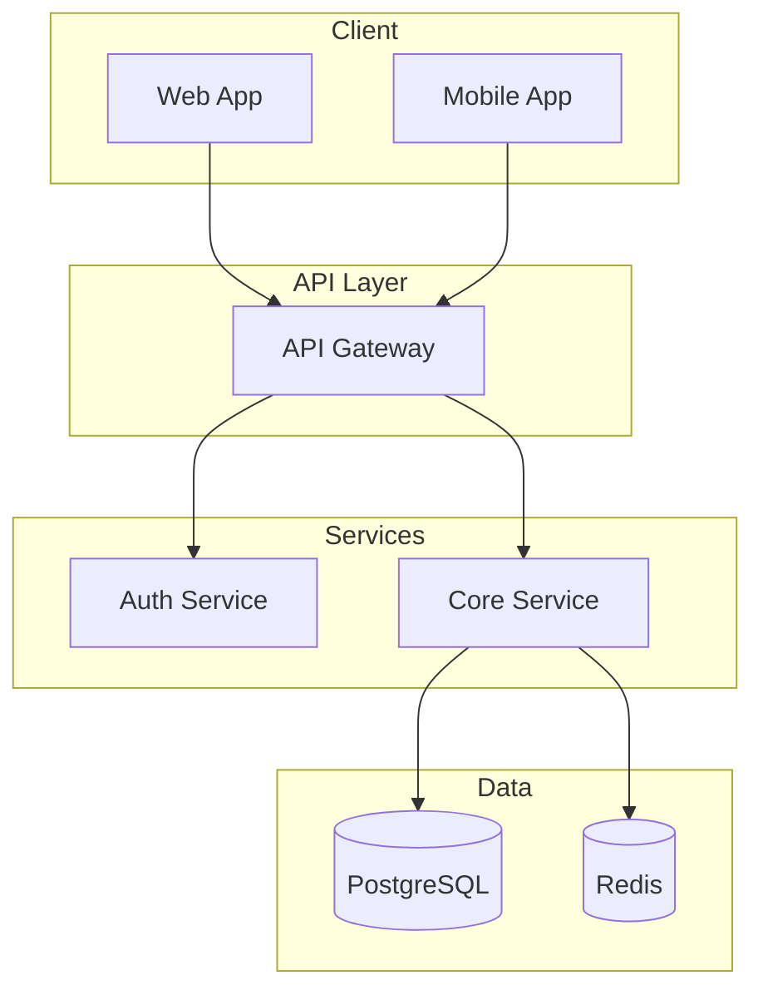
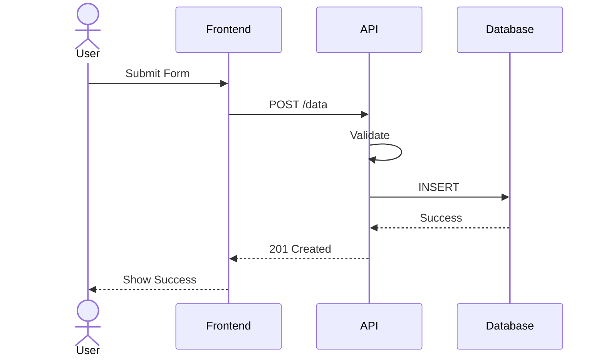

# Architecture.md Guide

## Purpose

The `architecture.md` file describes the system's structure, components, interactions, and technical decisions with supporting diagrams.

## Prerequisites

Read and reference:
- `about.md` — for scope and features
- `specs.md` — for technology choices

## Diagram Requirements

**All major sections MUST include Mermaid diagrams** generated based on project context.

### Diagram Types to Include

1. **System Overview** — High-level component diagram
2. **Data Flow** — Sequence diagram for key operations
3. **Data Model** — ER diagram for entities
4. **Infrastructure** — Deployment architecture
5. **Authentication** — Security flow (if applicable)

## Creation Workflow

### Phase 1: Component Identification

1. **What are the main parts?**
   - Based on features from about.md
   - Based on tech stack from specs.md
   - Help user decompose the system

2. **Generate Initial Diagrams**
   - Create system overview diagram
   - Present to user for validation
   - Iterate until accurate

### Phase 2: Interactions & Data

3. **How do components talk?**
   - Communication patterns
   - API contracts
   - Event flows

4. **What data exists?**
   - Main entities
   - Relationships
   - Data storage locations

### Phase 3: Non-Functional Architecture

5. **How will it scale?**
   - Scaling strategy
   - Caching approach
   - Load balancing

6. **How is it secured?**
   - Authentication mechanism
   - Authorization model
   - Data protection

7. **How is it monitored?**
   - Logging strategy
   - Metrics collection
   - Alerting approach

### Phase 4: Decisions Documentation

8. **Document key decisions**
   - Why each technology was chosen
   - Alternatives considered
   - Trade-offs made

## Helping Non-Technical Users

### When explaining architecture:

1. **Use analogies**
   - "The API is like a waiter taking orders to the kitchen"
   - "The database is like a filing cabinet"
   - "The cache is like a notepad for quick lookups"

2. **Explain why decisions matter**
   - "This pattern helps when traffic increases"
   - "This separation makes future changes easier"

3. **Present alternatives with pros/cons**
   ```
   Option A: Monolith
   ✅ Simpler to start
   ❌ Harder to scale parts independently
   
   Option B: Microservices
   ✅ Scale components independently
   ❌ More complex to manage
   ```

### When user lacks technical understanding:

1. Make recommendations based on:
   - Project complexity (from about.md)
   - Scale requirements (from specs.md)
   - Team capabilities

2. Explain reasoning:
   - "Given your expected user count, I recommend..."
   - "Since you need real-time updates, this pattern..."

## Mermaid Diagram Guidelines

### System Overview Example


### Sequence Diagram Example


## Completion Criteria

- [ ] All major components are identified
- [ ] System overview diagram is accurate
- [ ] Data flow diagrams exist for key operations
- [ ] Data model is defined
- [ ] Security architecture is documented
- [ ] Scaling strategy is outlined
- [ ] Technical decisions are documented with rationale
- [ ] User understands and approves architecture
